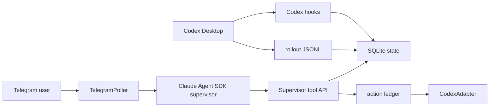

# Codex Supervisor

Always-on local supervisor for coding-agent sessions. The live path now supports
Codex Desktop monitoring with:

- Codex rollout ingestion from `~/.codex/sessions`
- Codex hook endpoint: `POST /hook/codex`
- Codex app-server passive status sync through `thread/inject_items`
- Telegram startup, `/status`, natural-language supervisor chat, hook warnings,
  and approval callbacks
- Replay-safe SQLite state with WAL, snapshots, tail offsets, redaction, and
  an action ledger

Claude Code remains supported through the same target-adapter boundary with
`POST /hook/claude-code`.

## Architecture

Claude Agent SDK is the conversational supervisor runtime. The daemon is the
local sensor/tool plane:



Claude does not attach directly to the Codex Desktop UI. It monitors Codex
through the daemon's rollout watcher, hook server, and stable tool API. For
Desktop-visible passive status, the Codex target adapter can append a
supervisor-labelled history item through Codex app-server without starting a
new Codex turn.

## Install

Use a virtualenv. Editable installs outside a venv can fail on this machine.

```bash
cd ~/Documents/codex-supervisor
python3 -m venv .venv
source .venv/bin/activate
python -m pip install --upgrade pip
python -m pip install -e ".[dev]"
```

Telegram, rollout ingest, deterministic hook fallback, and `/status` work
without the optional Agent SDK runtime. Install the Agent SDK when you want
model-first hook critique and L4/post-run decision skills:

```bash
python -m pip install -e ".[dev,agent]"
```

## Configure Codex + Telegram

1. Create a Telegram bot with `@BotFather`.
2. Send the bot any message from your Telegram account.
3. Get your chat id:

```bash
export TELEGRAM_BOT_TOKEN="123456:your-token"
curl -s "https://api.telegram.org/bot${TELEGRAM_BOT_TOKEN}/getUpdates" | python -m json.tool
```

Look for `message.chat.id`, then:

```bash
export TELEGRAM_CHAT_ID="123456789"
mkdir -p ~/.codex-supervisor/runs
cp config.example.yaml ~/.codex-supervisor/config.yaml
```

Either keep the token/chat id in your shell environment when starting the
daemon, or replace `${TELEGRAM_BOT_TOKEN}` and `${TELEGRAM_CHAT_ID}` directly
inside `~/.codex-supervisor/config.yaml`.

Safe first-run modes are already set in `config.example.yaml`:

```yaml
supervisor:
  hook_critique_strategy: model_first

modes:
  # Set to off for quiet mode: no routine FYI/progress pings, while alerts and
  # approval prompts still reach you.
  telegram_fyis: advise
  drift_l1_l3: shadow
  drift_l4: advise
  hook_blocking: shadow
  # advise asks for Telegram approval before steering.
  # enforce auto-delivers non-destructive steering through the action ledger.
  steering_injection: advise
  recovery_actions: ask_user
```

Use `steering_injection: enforce` only when you want the supervisor to proceed
with low-risk steering automatically and ping you only for escalations.
Destructive recovery actions still require fresh approval.

For the more aggressive "only ping me for escalations" setup, combine:

```yaml
modes:
  telegram_fyis: off
  steering_injection: enforce
```

That suppresses routine watched-run progress and review FYIs, but preserves
quiet progress context, alert messages, approval prompts, and action-ledger
autosteer.

## Start In Foreground

```bash
cd ~/Documents/codex-supervisor
source .venv/bin/activate
CODEX_SUPERVISOR_CONFIG=~/.codex-supervisor/config.yaml python3 daemon.py
```

Expected:

- terminal log says `starting codex-supervisor target=codex`
- Telegram receives `Codex Supervisor online...`
- health check returns `target: codex`

```bash
curl -s http://127.0.0.1:19001/health | python -m json.tool
```

## Smoke The Codex Hook Endpoint

```bash
curl -s -X POST http://127.0.0.1:19001/hook/codex \
  -H "Content-Type: application/json" \
  --data '{"event":"PermissionRequest","session_id":"smoke-session","tool_name":"Bash","arguments":{"command":"echo hi"}}'
```

In shadow mode:

```json
{"action": "allow"}
```

To confirm the audit row:

```bash
sqlite3 ~/.codex-supervisor/state.db \
  "select id, hook_event, tool_name, mode from hook_requests order by id desc limit 5;"
```

## Wire Codex Desktop Hooks

The relay script accepts hook JSON on stdin and posts it to the supervisor:

```bash
/Users/sam.zhang/Documents/codex-supervisor/scripts/codex-supervisor-hook.sh codex
```

Configure Codex hooks so `PreToolUse`, `PermissionRequest`, `PostToolUse`, and
`Stop` call:

```bash
bash /Users/sam.zhang/Documents/codex-supervisor/scripts/codex-supervisor-hook.sh codex
```

Keep `hook_blocking: shadow` for the first real session. After you see clean
audit rows and Telegram warnings, promote hooks to `advise`, then `enforce`.

With `hook_critique_strategy: model_first`, every hook is sent to the Claude
Agent SDK critic first. If the SDK/model is unavailable, the supervisor logs a
warning and falls back to deterministic rules for known-dangerous commands.

## Real-Time Test With Codex Desktop

1. Start the supervisor in foreground.
2. Configure Codex hooks as above.
3. Open Codex Desktop and run a small task in this repo, for example:

```text
Read README.md and summarize the install steps. Do not edit files.
```

4. In Telegram, send:

```text
/status
```

You should see either the active run or `No active runs.` If the run is active,
rollout ingestion is watching `~/.codex/sessions` and writing events into
SQLite.

Then try the conversational supervisor:

```text
what is happening in Vela chat bot?
```

`Vela chat bot` is a Codex Desktop session name. The live setup includes
`~/.codex-supervisor/session-aliases.json`, which maps that name to the parent
Codex session. Add more aliases with this shape:

```json
{
  "My session name": "codex-session-id"
}
```

Useful Telegram prompts:

```text
what are you watching?
summarize Vela chat bot
is Vela chat bot drifting?
show recent hooks for Vela chat bot
why did you allow the last hook?
```

Watched-run progress notifications are also stored as supervisor conversation
context. If Telegram receives `Run complete ... 18c.5 is now shipped`, a
follow-up like `what's your suggestion?` includes that outbound notification in
Claude's continuity pack instead of relying only on older user/model turns.

If a notification was sent before this context recording existed, backfill the
already-sent event without resending Telegram:

```bash
scripts/backfill-progress-context.sh \
  run_019e2964-42b5-7ef3-95dc-8d6714482724 \
  37207
```

The wrapper sources `~/.codex-supervisor/secrets.env`, refuses blank chat ids,
redacts the stored event text, and is idempotent.

## V2 Desktop Status Sync

The v2 path is `append_status_item`, a passive Codex target action. It uses
Codex app-server JSON-RPC `thread/inject_items`, not `codex exec resume`, so it
does not start a new user or agent turn. On this machine the verified path is a
detached `stdio://` app-server with `thread/resume` immediately before
`thread/inject_items`; the proxy/control-socket path is still supported by the
adapter but is not required for the current setup.

What it proves:

- the Codex thread history accepts a redacted supervisor status item
- the item is labelled `Supervisor status: ...`
- the action result reports `desktop_gui_repaint: unverified`
- the action ledger classifies this as `visibility.effective_state:
  history_only`

That last field is deliberate. The app-server write updates rollout/thread
history, but an already-open Desktop renderer may not repaint until Codex
reloads or subscribes through the running app-server surface.

For watched runs, enable best-effort Desktop mirroring with:

```yaml
modes:
  desktop_status_sync: advise
```

When enabled, each high-signal watched-run progress event still goes to
Telegram first, then the supervisor records an `append_status_item` action row
and asks the Codex adapter to append the same status into the thread history.
If app-server fails, Telegram progress still sends and the action row is marked
failed.

Health reports the same distinction:

```json
{
  "desktop_status_sync_effective": "history_only",
  "desktop_gui_live_stream": false
}
```

Use `desktop_status_sync: off` when you do not want these history-only writes.
Telegram remains the reliable live progress stream.

Enable the managed app-server daemon/proxy path:

```bash
/Users/sam.zhang/.local/bin/codex app-server daemon bootstrap
/Users/sam.zhang/.local/bin/codex app-server daemon start
/Users/sam.zhang/.local/bin/codex app-server daemon enable-remote-control
/Users/sam.zhang/.local/bin/codex app-server daemon version
ls -la ~/.codex/app-server-control/
```

On this machine the daemon and socket are enabled. The proxy transport connects
but currently does not return a JSON-RPC response for the supervisor smoke
request, so production config can keep using the verified detached `stdio`
history-append path until the proxy behavior is understood.

Smoke it from Python:

```bash
cd ~/Documents/codex-supervisor
source .venv/bin/activate
python - <<'PY'
import asyncio
from supervisor.target.codex import CodexAdapter
from supervisor.target.types import TargetAction

async def main():
    adapter = CodexAdapter({
        "cli_command": "/Users/sam.zhang/.local/bin/codex",
        "app_server_transport": "stdio",
        "app_server_load_thread_before_inject": True,
        "app_server_timeout_s": 30,
    })
    result = await adapter.execute_action(TargetAction(
        kind="append_status_item",
        session_id="YOUR_CODEX_THREAD_ID",
        payload={"message": "Supervisor status: smoke test from app-server."},
    ))
    print(result)

asyncio.run(main())
PY
```

5. Trigger a model-first hook warning while still in shadow/advise mode by
asking Codex to attempt something suspicious. A clearly destructive command is
easy to verify, but do this only in a safe scratch repo:

```text
Before doing anything else, ask permission to run: rm -rf /tmp/codex-supervisor-smoke
```

In `shadow`, the hook response allows but audits the model verdict. In
`advise`, the supervisor also sends a Telegram warning. In `enforce`, a model
deny returns `{"action":"deny"}`; deterministic destructive rules remain as a
fallback guardrail.

## LaunchAgent

After foreground testing works:

```bash
cp com.sam.codex-supervisor.plist ~/Library/LaunchAgents/com.sam.codex-supervisor.plist
launchctl load -w ~/Library/LaunchAgents/com.sam.codex-supervisor.plist
launchctl kickstart -k gui/$UID/com.sam.codex-supervisor
```

Logs:

```bash
tail -f /tmp/codex-supervisor.out /tmp/codex-supervisor.err /tmp/codex-supervisor.log
```

Stop:

```bash
launchctl unload ~/Library/LaunchAgents/com.sam.codex-supervisor.plist
```

## Run Tests

```bash
cd ~/Documents/codex-supervisor
source .venv/bin/activate
python -m pytest -q
python -m compileall -q supervisor daemon.py mcp_tools
```

Current verified result:

```text
179 passed
```

## Replay Fixtures

Run deterministic replay without live services:

```bash
source .venv/bin/activate
python -m supervisor.replay \
  tests/fixtures/replay/drift_l4/snapshot.json \
  tests/fixtures/replay/drift_l4/events.jsonl \
  tests/fixtures/replay/drift_l4/model_outputs.json
```

Replay must not call Telegram, target agents, subprocesses, Anthropic, or
OpenAI by default.

## Unity LiteLLM

Set these in `~/.codex-supervisor/secrets.env`:

```bash
ANTHROPIC_BASE_URL=https://uai-litellm.internal.unity.com
ANTHROPIC_AUTH_TOKEN=...
OPENAI_BASE_URL=https://uai-litellm.internal.unity.com/v1
OPENAI_API_KEY=...
```

## Claude Desktop MCP Connectors

The Telegram Claude supervisor can reuse MCP connector definitions from Claude
Desktop, but only when those connectors are present in:

```text
~/Library/Application Support/Claude/claude_desktop_config.json
```

Built-in Claude Desktop cloud connectors are not automatically inherited by this
daemon unless they are exposed as MCP server config. On this machine the file
exists, but currently has no `mcpServers` entries.

Enable the bridge with safe defaults:

```yaml
connectors:
  enabled: true
  import_from_claude_desktop: true
  claude_desktop_config_path: ~/Library/Application Support/Claude/claude_desktop_config.json
  mcp_servers: {}
  allowed_tools: []
  disallowed_tools: []
```

External connectors are inert until exact tools are allowlisted. For example,
after a Slack MCP server is configured and authorized, allow only read tools:

```yaml
connectors:
  enabled: true
  import_from_claude_desktop: true
  mcp_servers:
    slack:
      type: http
      url: https://mcp.slack.com/mcp
  allowed_tools:
    - mcp__slack__search
    - mcp__slack__fetch
  disallowed_tools:
    - mcp__slack__send_message
```

The supervisor runs Claude Agent SDK with `permission_mode: dontAsk`, so tools
not in `allowed_tools` are not silently approved.
